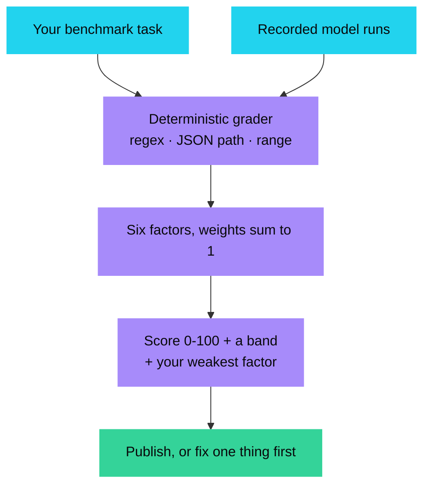
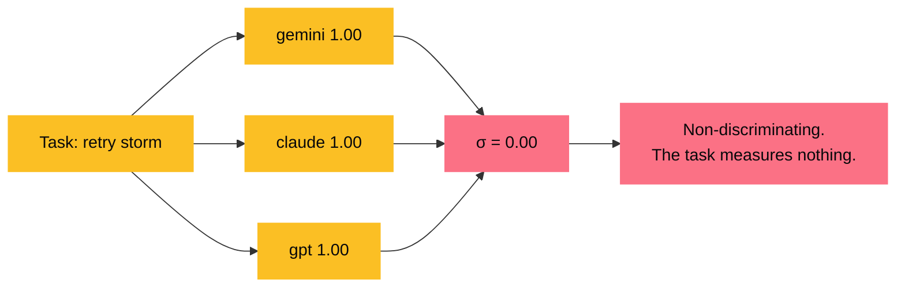
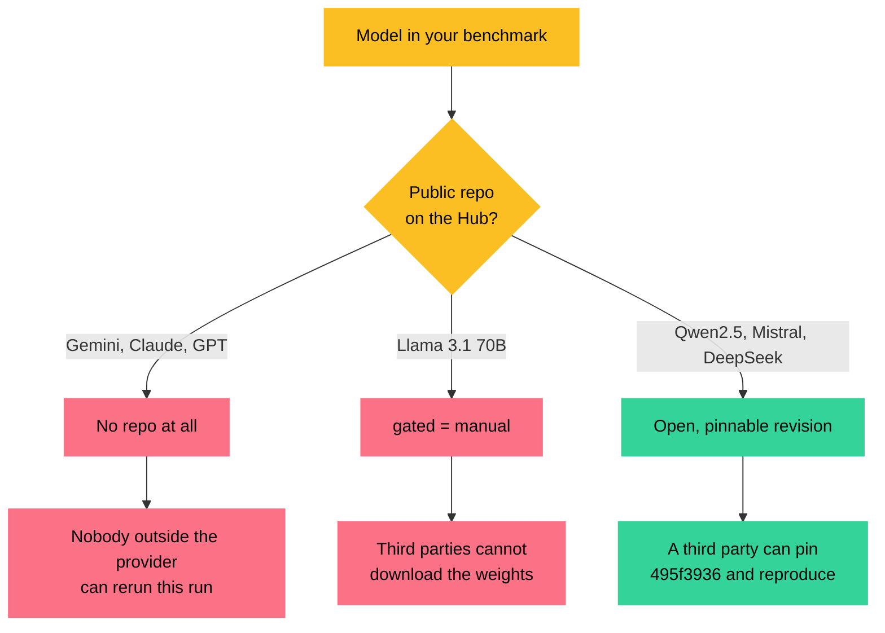
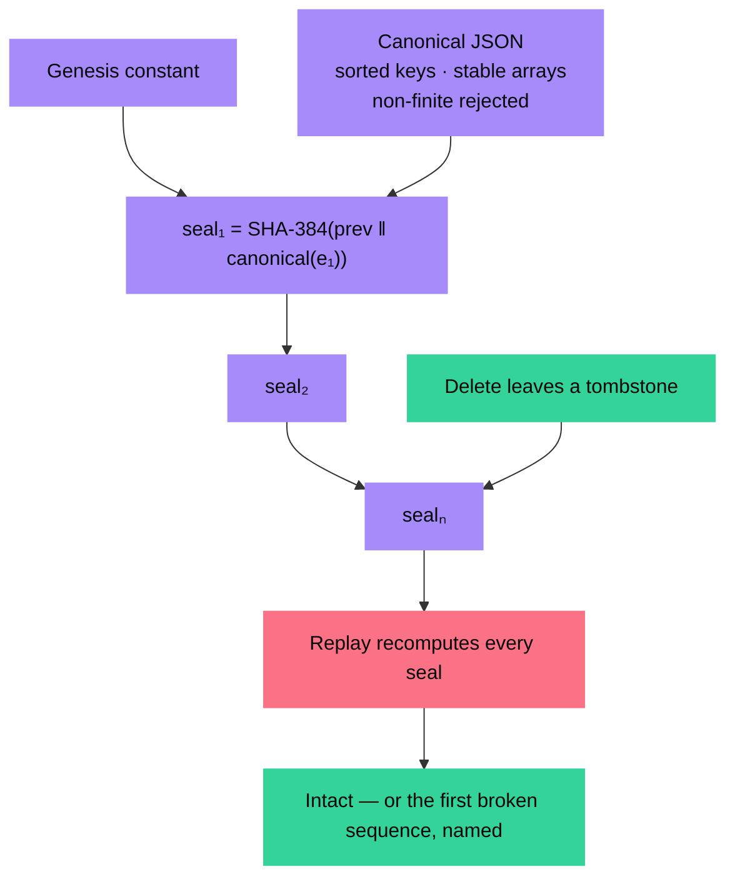

# I built a tool that grades the benchmark instead of the model

**A deterministic grader for LLM benchmark tasks, with a hash chain anyone can replay.**

[Live app](https://crucible-aniruddha-adaks-projects.vercel.app) · [Source on GitHub](https://github.com/aniruddhaadak80/crucible) · [API health](https://crucible-aniruddha-adaks-projects.vercel.app/api/health) · [Agent console](https://crucible-aniruddha-adaks-projects.vercel.app/agent)

---

If your eval asks a language model whether an answer is "good enough", you do not
have a benchmark. You have a second model with an opinion, and you cannot replay
it.

Two days of work on [Crucible](https://github.com/aniruddhaadak80/crucible)
taught me something I did not expect to learn, and it has nothing to do with
grading models:

> **The task is the thing that is broken, and almost nobody is measuring it.**

## The idea

Every eval answers "how did the model do?" Crucible also answers "is this task
even worth publishing?" — with six factors, every one computed from a measured
quantity.

You write assertions that decide the answer by exact comparison: regex, JSON
paths, numeric ranges, forbidden substrings. No model is asked whether the answer
looks right. Then the engine scores the *task*.



| Factor | Weight | What it actually measures |
| --- | --- | --- |
| Determinism | 0.26 | Share of the grade decided without a model in the loop |
| Discrimination | 0.22 | Population σ of recorded scores, against a 0.22 target |
| Fixture seal | 0.18 | Whether revision, seed, temperature and inputs are pinned |
| Assertion specificity | 0.16 | Regex and JSON paths outrank substring matching |
| Reproduction | 0.10 | Whether a stranger can rerun it at all |
| Cost fit | 0.08 | Whether recorded runs fit your declared budget |

## Finding 1 — most evals cannot tell two models apart

This is the one that surprised me. Discrimination is the population standard
deviation of your recorded scores. If every model you tested scores 1.0, the task
scores **zero** on it, and the verdict says the task is measuring agreement rather
than capability.

Two of my three bundled reference tasks are deliberately constructed to fail this,
and it is the most useful failure in the product:



All three models escalate correctly on a flaky tool, which sounds like a good
result. It is not evidence of anything. You needed a near-miss fixture where a
plausible wrong answer starts to cost points.

## Finding 2 — closed models cannot be reproduced, so say so

The app pulls live facts from the Hugging Face Hub for every model in your lineup.
Two results I did not predict:



So when a leaderboard says "we evaluated Gemini 2.5 Pro", the honest question is
not whether that model is good. It is: **what would a reader have to pin in order
to reproduce that number?** For the proprietary models the answer is nothing,
because there is no public revision to pin. Crucible reports that as
*unreproducible* rather than as a quality judgement.

This feeds the reproduction factor directly. Pin a revision that no longer matches
the Hub head, or target a gated model, and the factor drops with the reason
attached.

## Finding 3 — cross-language determinism is harder than it looks

The app exports a runnable [Kaggle Benchmarks](https://www.kaggle.com/benchmarks)
task so you can push it and run it against real models. The grader ships as
self-contained Python. I wrote a test that diffs the Python scores against the
TypeScript engine transcript by transcript.

It failed twice, and both failures would have shipped a broken bundle:

```mermaid
graph LR
  A["TypeScript engine"] --> B["Exported Python grader"]
  B --> C["Compare every score"]
  C --> D1["Bug 1: JSON true/false/null"]
  C --> D2["Bug 2: json.dumps spacing"]
  D1 --> E["NameError on first run"]
  D2 --> F["[1, 2, 3] ≠ [1,2,3]<br/>silent wrong score"]
  E --> G["Fixed, 36/36 parity"]
  F --> G

  classDef r fill:#fb7185,color:#08080a,stroke:#fb7185
  classDef g fill:#34d399,color:#08080a,stroke:#34d399
  classDef a fill:#22d3ee,color:#08080a,stroke:#22d3ee
  class D1,D2,E,F r
  class G g
  class A,B,C,a
```

The first was the interesting one. `ast.parse` **passed**. Python happily parses
`true` as an identifier, so every syntax check was green — and then the file
raised `NameError` the moment it ran. Syntax validity is not correctness.

The second was quieter: Python's `json.dumps` writes `[1, 2, 3]` and JavaScript's
`JSON.stringify` writes `[1,2,3]`, so a JSON assertion scored differently in the
exported bundle than in the engine. Nothing crashed. The number was just wrong.

## The tamper-evident part

Every create, update, grade, decision and delete appends to a per-task SHA-384
chain over canonical JSON, and anyone can replay it.



I pinned two hand-verified digest vectors, so a change to canonical form cannot
pass silently. And here is the bug I would never have found by reading the code:

> Postgres `timestamptz::text` renders `2026-10-03 07:20:31.123456+00`.
> `toISOString()` produced `2026-10-03T07:20:31.123Z`.
> Every stored seal disagreed with its own recomputation — and only a replay test
> that reads back from the database could ever see it.

Reads now go through an expression that reproduces the hashed bytes exactly.

## Try it in twenty seconds

The app is live, needs no API key, and every request below is real.

```bash
# Is the hosted store actually there?
curl -s https://crucible-aniruddha-adaks-projects.vercel.app/api/health

# Forge a task
curl -sX POST https://crucible-aniruddha-adaks-projects.vercel.app/api/tasks \
  -H 'content-type: application/json' \
  -d '{"name":"unit drift","failureMode":"Returns micrograms where the schema wants milligrams.","prompt":"Return ONLY {\"meta\":{\"units\":\"mg\"}}","assertions":[{"id":"u","kind":"json_path_equals","label":"mg","weight":3,"path":"meta.units","jsonExpected":"mg"},{"id":"n","kind":"not_contains","label":"no µg","weight":2,"needle":"µg"}],"transcripts":[{"modelId":"Qwen/Qwen2.5-72B-Instruct","completion":"{\"meta\":{\"units\":\"mg\"}}","latencyMs":1840,"tokensOut":96},{"modelId":"google/gemini-2.5-flash","completion":"{\"meta\":{\"units\":\"µg\"}}","latencyMs":2100,"tokensOut":101}]}'

# Ask the eleven-tool agent to do it instead
curl -sX POST https://crucible-aniruddha-adaks-projects.vercel.app/api/mcp \
  -H 'content-type: application/json' \
  -d '{"jsonrpc":"2.0","id":1,"method":"tools/list"}'
```

The mutating agent tools are idempotent: retry with the same `idempotencyKey` and
you get the original task back, not a second one.

## What I would build next

- **Publish chain heads to an append-only log.** A hash chain detects rewriting;
  it does not stop someone with write access recomputing the whole log from
  genesis. Publishing heads externally would close that.
- **Suite-level runs.** Grade a whole benchmark, not one task at a time.
- **Assertion diffing.** When you revise a task, re-score every historical
  transcript against both versions and show what actually moved.

## Honest limits

- **This does not score models.** A high grade means the *task* is worth
  publishing. It says nothing about capability.
- **Judge-dependent weight is never counted as a pass.** It is reported as
  undecided and the verdict is marked degraded.
- **The chain detects rewriting, it does not prevent it.** See Finding 3 above.
- **Reference transcripts are bundled fixtures, not live runs.** They are
  labelled as such everywhere they appear.

## Repo

[github.com/aniruddhaadak80/crucible](https://github.com/aniruddhaadak80/crucible) — MIT.

The engine, the grader, the audit chain, the agent tools and the verification
scripts are all in the repository. 62 unit tests, 33 store checks, a
TypeScript-to-Python parity check, a 97-check HTTP journey, and 105 checks against
the live deployment.

Issues and pull requests welcome — especially ones that find a case where a score
is unearned.